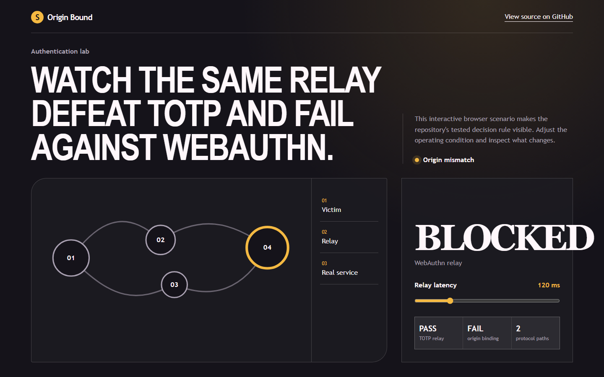
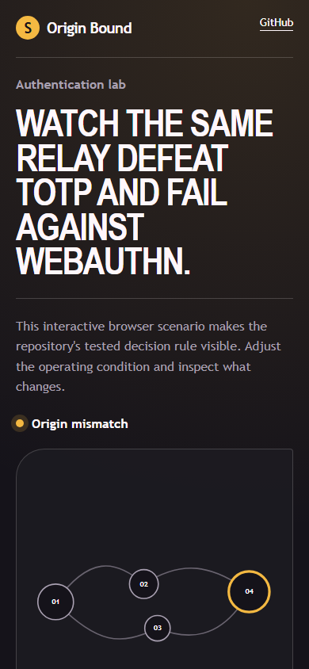

# originbound

> A contained lab showing the same relay succeeding against TOTP and failing against WebAuthn - with the protocol field that causes it.

## Live deployment

[](https://github.com/SlateGitOrg/originbound/actions/workflows/ci.yml)

[Open the interactive Origin Bound demo](https://slategitorg.github.io/originbound/)

The deployed interface uses a deterministic offline scenario to make the repository's tested decision rule visible without external services or private data.

### Desktop



### Mobile



`COMPACT` · **Cybersecurity** · Advanced · ~5-6 days · Healthcare - clinician remote access

**Primary language:** TypeScript
**Tags:** `webauthn`, `passkeys`, `mfa`, `phishing-resistance`, `authentication`

---

## The problem

Organisations roll out MFA and are still phished, because TOTP codes and push approvals can be relayed by an attacker-in-the-middle in real time. The distinction between 'MFA' and 'phishing-resistant MFA' is the entire game, and most engineers - including most people rolling out MFA - cannot articulate what makes the difference.

## ⭐ The differentiator

Demonstrates **origin binding defeating a relay** in a sealed lab: the same relay setup succeeds against TOTP and fails against WebAuthn, with the exact protocol field responsible (`clientDataJSON.origin`, bound into the signature) shown in the trace. A generic WebAuthn demo shows a passkey working and never shows *why* it is different, which is the only part worth knowing.

This is the sentence to lead with when someone asks you to walk through the
project. Everything else in this repo exists to make it true and to prove it.

## Data

Self-contained lab. SoftWebAuthn provides a virtual authenticator; local DNS and all traffic stay inside the Docker Compose network. No third party is involved at any point.

> No paid API key is required to run or demo this project. Where a paid
> service would add value it is wired as an optional enhancement behind an
> interface with an offline mock as the default implementation.

## Stack

- TypeScript, SimpleWebAuthn
- Node + Docker Compose (sealed network, local DNS)
- Playwright for the ceremony traces

## Core capabilities

- Full registration and authentication ceremonies with attestation verification
- Contained comparison harness: relay attempt against TOTP, then against WebAuthn
- Credential lifecycle - multiple authenticators, revocation, and a documented recovery design
- Signature counter monitoring for cloned-authenticator detection
- Annotated protocol trace highlighting the field that defeats the relay

## Repository layout

```
src/server/
src/client/
lab/                      # sealed compose network + local DNS
docs/
test/
```

## Build plan

1. Working WebAuthn ceremony first.
2. Then TOTP, then the relay harness inside the sealed network - relay the TOTP and watch it succeed.
3. Point the same relay at WebAuthn and capture the rejection with its trace. That trace is the deliverable.
4. Recovery design last, and write it up honestly - recovery is where most passkey deployments reintroduce phishability.

## Testing strategy

Assert the relay **succeeds** against TOTP and **fails** against WebAuthn with the specific origin-mismatch error. Assert cloned-authenticator detection fires on a replayed signature counter. The TOTP half of that first assertion is what gives the WebAuthn half its meaning.

Tests assert **correctness**, not merely that the code runs. A green suite on
this repo is a claim about behaviour under adversarial conditions; treat any
test that would pass against a deliberately broken implementation as a bug in
the test.

## Quality & safety layer

Everything runs inside a sealed Docker network against a virtual authenticator you control. The relay component has no capability outside the lab and the README states this explicitly. This is a defensive demonstration of a control, not an attack tool.

## Measurable outcome

> A side-by-side trace showing a credential relay succeeding against TOTP and being rejected by WebAuthn, with the origin field that causes the rejection highlighted.

State it in these terms — business units, not technical ones — in your CV
bullet and in the first thirty seconds of describing the project.

## Interview questions this project answers

- **Why is TOTP phishable and WebAuthn not?**
- **What exactly is signed in a WebAuthn assertion?**
- **How do you handle account recovery without reintroducing phishability?**

## What this deliberately is *not*

- Not an attack tool. The relay exists only inside the sealed lab, against your own virtual authenticator.


## Run it now

```bash
npm test        # runs the suite; no install step needed
npm run demo    # the 60-second artefact
```

Requires Node 22.6+ (24 recommended). TypeScript runs natively via
type stripping - there is no build step and no `node_modules`.

## Getting started

```bash
git clone <your-fork-url> originbound
cd originbound
docker compose up -d          # sealed network + local DNS
npm install
npm run demo:totp             # relay succeeds
npm run demo:webauthn         # relay rejected - read the trace
npm test
```

Docker is supported but optional — every path above works on a plain
Windows/macOS/Linux laptop without a cloud account.

## Definition of done

- [ ] The differentiator above is implemented, and a test proves it
- [ ] The measurable outcome is produced by a command anyone can run
- [ ] `README` explains the one decision a generic version gets wrong
- [ ] CI runs the full suite on every push and is green on `main`
- [ ] A recruiter can see the headline artefact in under 60 seconds

## Licence

MIT — see [LICENSE](LICENSE).
